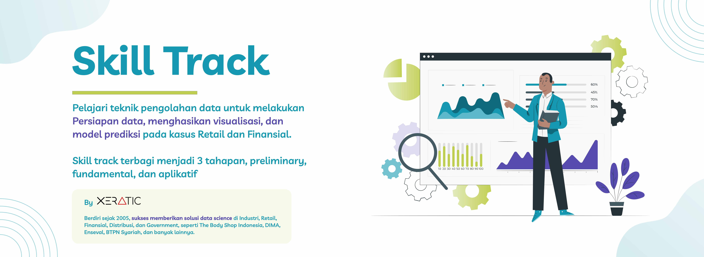
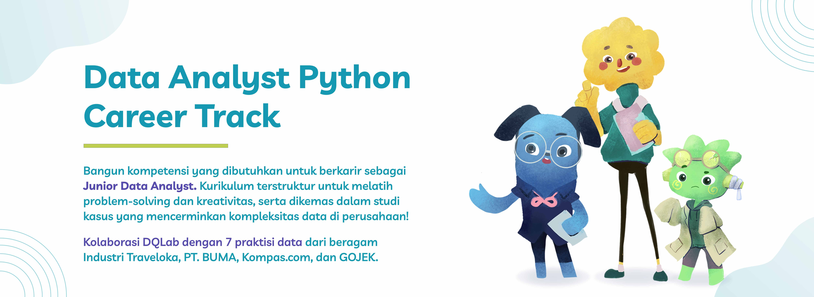
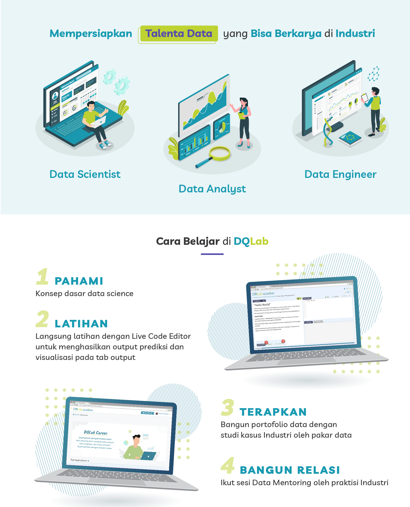

 

  

 

  <a href="https://academy.dqlab.id/main/module">DQLab</a> is a complete platform to learn all about data. If you want to become a data practitioner, then it is a must to study at DQLab. There are three programming languages provided, R, Python, and SQL. These three languages are very popular in today's data science world.

 
This is a repository that I created to share the result of learning from materials and projects in DQLab. Markdown template inspired from <a href="https://github.com/myarist/DQLab">Arist</a>

---

<h1 align="center">Skill Track</h1>

## R Materials

Class List

### Preparation Class

Module List

+ [[📂](https://github.com/agusputra4/DQLab/tree/main/Learn/R/Prep%20Class/Introduction%20to%20Data%20Science%20with%20R)] [[🔍](https://academy.dqlab.id/main/package/practice/111)] [[📃](https://academy.dqlab.id/certificate/pdf/DQLABBGINRECWRFI)] Introduction to Data Science with R

+ [[📂](https://github.com/agusputra4/DQLab/tree/main/Learn/R/Prep%20Class/R%20Fundamental%20for%20Data%20Science)] [[🔍](https://academy.dqlab.id/main/package/practice/1)] [[📃](https://academy.dqlab.id/certificate/pdf/DQLABINTR1ACIRNN)] R Fundamental for Data Science

### Fundamental CLass

Module List

- [[📂](https://github.com/agusputra4/DQLab/tree/main/Learn/R/Fundamental%20Class/Data%20Preparation%20in%20Data%20Science%20using%20R)] [[🔍](https://academy.dqlab.id/main/package/practice/12)] [[📃](https://academy.dqlab.id/certificate/pdf/DQLABDTWR1HDTTHI)] Data Preparation in Data Science using R

- [[📂](https://github.com/agusputra4/DQLab/tree/main/Learn/R/Fundamental%20Class/Statistics%20using%20R%20for%20Data%20Science)] [[🔍](https://academy.dqlab.id/main/package/practice/15)] [[📃](https://academy.dqlab.id/certificate/pdf/DQLABINTS1VBWADS)] Statistics using R for Data Science

- [[📂](https://github.com/agusputra4/DQLab/tree/main/Learn/R/Fundamental%20Class/Data%20Visualization%20in%20Data%20Science%20using%20R)] [[🔍](https://academy.dqlab.id/main/package/practice/2)] [[📃](https://academy.dqlab.id/certificate/pdf/DQLABDTVISEVMGVF)] Data Visualization in Data Science using R

- [[📂](https://github.com/agusputra4/DQLab/tree/main/Learn/R/Fundamental%20Class/Fundamental%20Data%20Visualization%20using%20R)] [[🔍](https://academy.dqlab.id/main/package/practice/257)] [[📃](https://academy.dqlab.id/certificate/pdf/DQLABINTR1CBOROI)] Fundamental Data Visualization using R

- [[📂](https://github.com/agusputra4/DQLab/tree/main/Learn/R/Fundamental%20Class/Advanced%20Data%20Visualization%20with%20ggplot2%20using%20R)] [[🔍](https://academy.dqlab.id/main/package/practice/259)] [[📃](https://academy.dqlab.id/certificate/pdf/DQLABAPL4%20WEKTJI)] Advanced Data Visualization with ggplot2 using R

### Industry Applied Class

Daftar Modul

- [[📂](https://github.com/agusputra4/DQLab/tree/main/Learn/R/Industry%20Applied%20Class/Data%20Science%20in%20Finance:%20Credit%20Risk%20Analysis)] [[🔍](https://academy.dqlab.id/main/package/practice/81)] [[📃](https://academy.dqlab.id/certificate/pdf/DQLABMLFCRUQKPMN)] Data Science in Finance: Credit Risk Analysis

<!--- [[📂]()] [[🔍](https://academy.dqlab.id/main/package/practice/11)] [[📃]()] Data Science in Retail: Market Basket Analysis

- [[📂]()] [[🔍](https://academy.dqlab.id/main/package/practice/7)] [[📃]()] Data Science in Marketing: Customer Segmentation

- [[📂]()] [[🔍](https://academy.dqlab.id/main/package/practice/89)] [[📃]()] Data Science in Finance: Dimension Reduction

- [[📂]()] [[🔍](https://academy.dqlab.id/main/package/practice/253)] [[📃]()] Analisis Data COVID19 di Indonesia

- [[📂]()] [[🔍](https://academy.dqlab.id/main/package/practice/281)] [[📃]()] A Walk Into Sensory Science -->

 

## Python Materials

Class List

### Preparation Class

Module List

- [[📂](https://github.com/agusputra4/DQLab/tree/main/Learn/Python/Prep%20Class/Introduction%20to%20Data%20Science%20with%20Python)] [[🔍](https://academy.dqlab.id/main/package/practice/162)] [[📃](https://academy.dqlab.id/certificate/pdf/DQLABINTP1FDETAO)] Introduction to Data Science with Python

- [[📂](https://github.com/agusputra4/DQLab/tree/main/Learn/Python/Prep%20Class/Python%20Fundamental%20for%20Data%20Science)] [[🔍](https://academy.dqlab.id/main/package/practice/45)] [[📃](https://academy.dqlab.id/certificate/pdf/DQLABINTP1HKMGPH)] Python Fundamental for Data Science

### Fundamental Class

Module List

- [[📂](https://github.com/agusputra4/DQLab/tree/main/Learn/Python/Fundamental%20Class/Data%20Wrangling%20Python)] [[🔍](https://academy.dqlab.id/main/package/practice/79)] [[📃](https://academy.dqlab.id/certificate/pdf/DQLABDTWP1OIWMJW)] Data Wrangling Python

- [[📂](https://github.com/agusputra4/DQLab/tree/main/Learn/Python/Fundamental%20Class/Python%20for%20Data%20Professional%20Beginner%20-%20Part%201)] [[🔍](https://academy.dqlab.id/main/package/practice/157)] [[📃](https://academy.dqlab.id/certificate/pdf/DQLABINTP1TDRAJN)] Python for Data Professional Beginner - Part 1

- [[📂](https://github.com/agusputra4/DQLab/tree/main/Learn/Python/Fundamental%20Class/Python%20for%20Data%20Professional%20Beginner%20-%20Part%202)] [[🔍](https://academy.dqlab.id/main/package/practice/160)] [[📃](https://academy.dqlab.id/certificate/pdf/DQLABINTP1FRUDRC)] Python for Data Professional Beginner - Part 2

- [[📂](https://github.com/agusputra4/DQLab/tree/main/Learn/Python/Fundamental%20Class/Python%20for%20Data%20Professional%20Beginner%20-%20Part%203)] [[🔍](https://academy.dqlab.id/main/package/practice/161)] [[📃](https://academy.dqlab.id/certificate/pdf/DQLABINTP1KRGTKV)] Python for Data Professional Beginner - Part 3

- [[📂](https://github.com/agusputra4/DQLab/tree/main/Learn/Python/Fundamental%20Class/Data%20Visualization%20with%20Python%20Matplotlib%20for%20Beginner%20-%20Part%201)] [[🔍](https://academy.dqlab.id/main/package/practice/164)] [[📃](https://academy.dqlab.id/certificate/pdf/DQLABDTWP1IJLFCE)] Data Visualization with Python Matplotlib for Beginner - Part 1

- [[📂](https://github.com/agusputra4/DQLab/tree/main/Learn/Python/Fundamental%20Class/Exploratory%20Data%20Analysis%20with%20Python%20for%20Beginner)] [[🔍](https://academy.dqlab.id/main/package/practice/163)] [[📃](https://academy.dqlab.id/certificate/pdf/DQLABINTP1BOPMTM)] Exploratory Data Analysis with Python for Beginner

- [[📂](https://github.com/agusputra4/DQLab/tree/main/Learn/Python/Fundamental%20Class/Data%20Visualization%20with%20Python%20Matplotlib%20for%20Beginner%20-%20Part%202)] [[🔍](https://academy.dqlab.id/main/package/practice/165)] [[📃](https://academy.dqlab.id/certificate/pdf/DQLABINTP1GWCTSF)] Data Visualization with Python Matplotlib for Beginner - Part 2

- [[📂](https://github.com/agusputra4/DQLab/tree/main/Learn/Python/Fundamental%20Class/Data%20Quality%20with%20Python%20for%20Beginner)] [[🔍](https://academy.dqlab.id/main/package/practice/166)] [[📃](https://academy.dqlab.id/certificate/pdf/DQLABDVIZ2CJGMTU)] Data Quality with Python for Beginner

- [[📂](https://github.com/agusputra4/DQLab/tree/main/Learn/Python/Fundamental%20Class/Machine%20Learning%20With%20Python%20for%20Beginner)] [[🔍](https://academy.dqlab.id/main/package/practice/169)] [[📃](https://academy.dqlab.id/certificate/pdf/DQLABDVIZ2GOVMNT)] Machine Learning With Python for Beginner

- [[📂](https://github.com/agusputra4/DQLab/tree/main/Learn/Python/Fundamental%20Class/Fundamental%20Data%20Visualization%20with%20Python)] [[🔍](https://academy.dqlab.id/main/package/practice/177)] [[📃](https://academy.dqlab.id/certificate/pdf/DQLABINTP1IBMKDP)] Fundamental Data Visualization with Python

- [[📂](https://github.com/agusputra4/DQLab/tree/main/Learn/Python/Fundamental%20Class/Data%20Manipulation%20with%20Pandas%20-%20Part%201)] [[🔍](https://academy.dqlab.id/main/package/practice/178)] [[📃](https://academy.dqlab.id/certificate/pdf/DQLABINTP1WPNHNR)] Data Manipulation with Pandas - Part 1

- [[📂](https://github.com/agusputra4/DQLab/tree/main/Learn/Python/Fundamental%20Class/Data%20Manipulation%20with%20Pandas%20-%20Part%202)] [[🔍](https://academy.dqlab.id/main/package/practice/252)] [[📃](https://academy.dqlab.id/certificate/pdf/DQLABINTP1NMRLRI)] Data Manipulation with Pandas - Part 2

- [[📂](https://github.com/agusputra4/DQLab/tree/main/Learn/Python/Fundamental%20Class/Statistic%20using%20Python%20for%20Data%20Science%20-%20Part%201)] [[🔍](https://academy.dqlab.id/main/package/practice/288)] [[📃](https://academy.dqlab.id/certificate/pdf/DQLABSWP1%20KMNICB)] Statistic using Python for Data Science - Part 1

- [[📂](https://github.com/agusputra4/DQLab/tree/main/Learn/Python/Fundamental%20Class/Statistic%20using%20Python%20for%20Data%20Science%20-%20Part%202)] [[🔍](https://academy.dqlab.id/main/package/practice/290)] [[📃](https://academy.dqlab.id/certificate/pdf/DQLABSWP1%20DMRDUD)] Statistic using Python for Data Science - Part 2

- [[📂](https://github.com/agusputra4/DQLab/tree/main/Learn/Python/Fundamental%20Class/Data%20Visualization%20using%20Plotnine)] [[🔍](https://academy.dqlab.id/main/package/practice/295)] [[📃](https://academy.dqlab.id/certificate/pdf/DQLABDVPP9FSHLBE)] Data Visualization using Plotnine

### Industry Applied Class

Daftar Modul

- [[📂](https://github.com/agusputra4/DQLab/tree/main/Learn/Python/Industry%20Applied%20Class/Data%20Analyst%20Project%20Business%20Decision%20Research)] [[🔍](https://academy.dqlab.id/main/package/practice/284)] [[📃](https://academy.dqlab.id/certificate/pdf/DQLABDVIZ2FGMAKW)] Data Analyst Project: Business Decision Research
  
<!-- - [[📂]()] [[🔍](https://academy.dqlab.id/main/package/practice/179)] [[📃]()] Basic Feature Discovering for Machine Learning

- [[📂]()] [[🔍](https://academy.dqlab.id/main/package/practice/247)] [[📃]()] Data Science in Telco: Data Cleansing

- [[📂]()] [[🔍](https://academy.dqlab.id/main/package/practice/249)] [[📃]()] Customer Churn Prediction using Machine Learning

- [[📂]()] [[🔍](https://academy.dqlab.id/main/package/practice/260)] [[📃]()] Data Science Project: Analisis Data COVID19 di Dunia & ASEAN

- [[📂]()] [[🔍](https://academy.dqlab.id/main/package/practice/287)] [[📃]()] Eksplorasi dan Analisis Data COVID-19 Indonesia using Python

- [[📂]()] [[🔍](https://academy.dqlab.id/main/package/practice/293)] [[📃]()] Data Science in Marketing : Customer Segmentation with Python

- [[📂]()] [[🔍](https://academy.dqlab.id/main/package/practice/294)] [[📃]()] Data Science in Marketing : Customer Segmentation with Python part 2 -->

## SQL Materials

Class List

### Preparation Class

Module List

- [[📂](https://github.com/agusputra4/DQLab/tree/main/Learn/SQL/Prep%20Class/Fundamental%20SQL%20with%20SELECT%20Statement)] [[🔍](https://academy.dqlab.id/main/package/practice/91)] [[📃](https://academy.dqlab.id/certificate/pdf/DQLABSQLT1EQOLHN)] Fundamental SQL with SELECT Statement

### Fundamental Class

Module List

- [[📂](https://github.com/agusputra4/DQLab/tree/main/Learn/SQL/Fundamental%20Class/Fundamental%20SQL%20Using%20SELECT%20Statement)] [[🔍](https://academy.dqlab.id/main/package/practice/213)] [[📃](https://academy.dqlab.id/certificate/pdf/DQLABSQLT1IIJVAE)] Fundamental SQL Using SELECT Statement

- [[📂](https://github.com/agusputra4/DQLab/tree/main/Learn/SQL/Fundamental%20Class/Fundamental%20SQL%20Using%20FUNCTION%20and%20GROUP%20BY)] [[🔍](https://academy.dqlab.id/main/package/practice/171)] [[📃](https://academy.dqlab.id/certificate/pdf/DQLABSQLT2ACASHE)] Fundamental SQL Using FUNCTION and GROUP BY

- [[📂](https://github.com/agusputra4/DQLab/tree/main/Learn/SQL/Fundamental%20Class/Fundamental%20SQL%20Using%20INNER%20JOIN%20and%20UNION)] [[🔍](https://academy.dqlab.id/main/package/practice/244)] [[📃](https://academy.dqlab.id/certificate/pdf/DQLABSQLT2BAPTDO)] Fundamental SQL Using INNER JOIN and UNION

- [[📂](https://github.com/agusputra4/DQLab/tree/main/Learn/SQL/Fundamental%20Class/Fundamental%20SQL%20Group%20By%20and%20Having)] [[🔍](https://academy.dqlab.id/main/package/practice/291)] [[📃](https://academy.dqlab.id/certificate/pdf/DQLABFSQL3CIJCMI)] Fundamental SQL Group By and Having

<!-- 

---

<h1 align="center">Project</h1>

## Project R 

Daftar Project

- [[📂](https://github.com/MyArist/DQLab/tree/master/Project/R/Project%20Machine%20Learning%20for%20Retail%20with%20R%20Product%20Packaging)] [[🔍](https://academy.dqlab.id/main/package/project/16)] [[📃](https://academy.dqlab.id/certificate/pdf/DQLABPRJCTGMBDEV/)] Project Machine Learning for Retail with R: Product Packaging

- [[📂](https://github.com/MyArist/DQLab/tree/master/Project/R/Project%20Data%20Analysis%20for%20Finance%20Performa%20Cabang)] [[🔍](https://academy.dqlab.id/main/package/project/215)] [[📃](https://academy.dqlab.id/certificate/pdf/DQLABPRJ8%20BWNISN)] Project Data Analysis for Finance: Performa Cabang

- [[📂](https://github.com/MyArist/DQLab/tree/master/Project/R/Project%20Data%20Analysis%20for%20Finance%20Proses%20Investasi%20Investor)] [[🔍](https://academy.dqlab.id/main/package/project/245)] [[📃](https://academy.dqlab.id/certificate/pdf/DQLABPRJC9BNWJUF/)] Project Data Analysis for Finance: Proses Investasi Investor

- [[❌]()] [[🔍](https://academy.dqlab.id/main/package/project/298)] [[❌]()] Project Assessment using R

- [[❌]()] [[🔍](https://academy.dqlab.id/main/package/project/299)] [[❌]()] Project Analisa Klasifikasi Pinjaman untuk Sektor UMKM

 -->

<!--   -->
    
<!--  -->

<!--## Project Python 

Daftar Project

- [[📂](https://github.com/MyArist/DQLab/tree/master/Project/Python/Data%20Science%20Challenge%20with%20Python)] [[🔍](https://academy.dqlab.id/main/package/project/158)] [[📃](https://academy.dqlab.id/certificate/pdf/DQLABPRJC2JCPTWE/)] Data Science Challenge with Python

- [[📂](https://github.com/MyArist/DQLab/tree/master/Project/Python/Data%20Engineer%20Challenge%20with%20Python)] [[🔍](https://academy.dqlab.id/main/package/project/170)] [[📃](https://academy.dqlab.id/certificate/pdf/DQLABPRJC3FKRGTH/)] Data Engineer Challenge with Python

- [[📂](https://github.com/MyArist/DQLab/tree/master/Project/Python/Project%20Machine%20Learning%20with%20Python%20Building%20Recommender%20System)] [[🔍](https://academy.dqlab.id/main/package/project/212)] [[📃](https://academy.dqlab.id/certificate/pdf/DQLABPRJC5HJDJDN/)] Project Machine Learning with Python: Building Recommender System

- [[📂](https://github.com/MyArist/DQLab/tree/master/Project/Python/Project%20Machine%20Learning%20with%20Python%20Building%20Recommender%20System%20with%20Similarity%20Function)] [[🔍](https://academy.dqlab.id/main/package/project/214)] [[📃](https://academy.dqlab.id/certificate/pdf/DQLABPRJC6RDCMTH)] Project Machine Learning with Python: Building Recommender System with Similarity Function

- [[❌]()] [[🔍](https://academy.dqlab.id/main/package/project/300)] [[❌]()] Modul DTS Professional Academy - Data Engineer

 -->

<!--   -->

<!--  -->

<!--## Project SQL 

Daftar Project

- [[📂](https://github.com/MyArist/DQLab/tree/master/Project/SQL/Data%20Engineer%20Challenge%20with%20SQL)] [[🔍](https://academy.dqlab.id/main/package/project/99)] [[📃](https://academy.dqlab.id/certificate/pdf/DQLABSQLTSKCOKDK/)] Data Engineer Challenge with SQL

- [[📂](https://github.com/MyArist/DQLab/tree/master/Project/SQL/Project%20Data%20Analysis%20for%20Retail%20Sales%20Performance%20Report)] [[🔍](https://academy.dqlab.id/main/package/project/182)] [[📃](https://academy.dqlab.id/certificate/pdf/DQLABPRJC4RTPCTH/)] Project Data Analysis for Retail: Sales Performance Report

- [[📂](https://github.com/MyArist/DQLab/tree/master/Project/SQL/Project%20Data%20Analysis%20for%20B2B%20Retail%20Customer%20Analytics%20Report)] [[🔍](https://academy.dqlab.id/main/package/project/246)] [[📃](https://academy.dqlab.id/certificate/pdf/DQLABPRJ10BTTRKO)] Project Data Analysis for B2B Retail: Customer Analytics Report

- [[📂](https://github.com/MyArist/DQLab/tree/master/Project/SQL/Data%20Analysis%20for%20E-Commerce%20Challenge)] [[🔍](https://academy.dqlab.id/main/package/project/261)] [[📃](https://academy.dqlab.id/certificate/pdf/DQLABSQLT2NBEATA/)] Data Analysis for E-Commerce Challenge

- [[📂](https://github.com/MyArist/DQLab/tree/master/Project/SQL/Project%20Fundamental%20SQL%20Group%20By%20and%20Having)] [[🔍](https://academy.dqlab.id/main/package/project/292)] [[📃](https://academy.dqlab.id/certificate/pdf/DQLABPFSQ2DHTHGF/)] Project: Fundamental SQL Group By and Having

 -->

 

---

<h1 align="center">Career Track</h1>

## Data Analyst Career Track (Python) [[🔍](https://academy.dqlab.id/main/track/67)] [[📃](https://academy.dqlab.id/certificate/pdf/DQLABDATRCGAEUUB/TRACK)] 

Understanding Fundamental Programming Language

- [[📂](https://github.com/agusputra4/DQLab/tree/main/Learn/Python/Fundamental%20Class/Python%20for%20Data%20Professional%20Beginner%20-%20Part%201)] [[🔍](https://academy.dqlab.id/main/package/practice/157)] [[📃](https://academy.dqlab.id/certificate/pdf/DQLABINTP1TDRAJN)] Python for Data Professional Beginner - Part 1

- [[📂](https://github.com/agusputra4/DQLab/tree/main/Learn/Python/Fundamental%20Class/Python%20for%20Data%20Professional%20Beginner%20-%20Part%202)] [[🔍](https://academy.dqlab.id/main/package/practice/160)] [[📃](https://academy.dqlab.id/certificate/pdf/DQLABINTP1FRUDRC)] Python for Data Professional Beginner - Part 2

- [[📂](https://github.com/agusputra4/DQLab/tree/main/Learn/Python/Fundamental%20Class/Python%20for%20Data%20Professional%20Beginner%20-%20Part%203)] [[🔍](https://academy.dqlab.id/main/package/practice/161)] [[📃](https://academy.dqlab.id/certificate/pdf/DQLABINTP1KRGTKV)] Python for Data Professional Beginner - Part 3

Understanding SQL and RDBMS enabling to process data in companies that have implemented IT systems

- [[📂](https://github.com/agusputra4/DQLab/tree/main/Learn/SQL/Fundamental%20Class/Fundamental%20SQL%20Using%20SELECT%20Statement)] [[🔍](https://academy.dqlab.id/main/package/practice/213)] [[📃](https://academy.dqlab.id/certificate/pdf/DQLABSQLT1IIJVAE)] Fundamental SQL Using SELECT Statement

- [[📂](https://github.com/agusputra4/DQLab/tree/main/Learn/SQL/Fundamental%20Class/Fundamental%20SQL%20Using%20FUNCTION%20and%20GROUP%20BY)] [[🔍](https://academy.dqlab.id/main/package/practice/171)] [[📃](https://academy.dqlab.id/certificate/pdf/DQLABSQLT2ACASHE)] Fundamental SQL Using FUNCTION and GROUP BY

- [[📂](https://github.com/agusputra4/DQLab/tree/main/Learn/SQL/Fundamental%20Class/Fundamental%20SQL%20Using%20INNER%20JOIN%20and%20UNION)] [[🔍](https://academy.dqlab.id/main/package/practice/244)] [[📃](https://academy.dqlab.id/certificate/pdf/DQLABSQLT2BAPTDO)] Fundamental SQL Using INNER JOIN and UNION

Understanding Concepts and Application of EDA in Business Study Case

- [[📂](https://github.com/agusputra4/DQLab/tree/main/Learn/Python/Fundamental%20Class/Exploratory%20Data%20Analysis%20with%20Python%20for%20Beginner)] [[🔍](https://academy.dqlab.id/main/package/practice/163)] [[📃](https://academy.dqlab.id/certificate/pdf/DQLABINTP1BOPMTM)] Exploratory Data Analysis with Python for Beginner

Processing Small to Large Amounts of Datasets

- [[📂](https://github.com/agusputra4/DQLab/tree/main/Learn/Python/Fundamental%20Class/Data%20Manipulation%20with%20Pandas%20-%20Part%201)] [[🔍](https://academy.dqlab.id/main/package/practice/178)] [[📃](https://academy.dqlab.id/certificate/pdf/DQLABINTP1WPNHNR)] Data Manipulation with Pandas - Part 1

- [[📂](https://github.com/agusputra4/DQLab/tree/main/Learn/Python/Fundamental%20Class/Data%20Manipulation%20with%20Pandas%20-%20Part%202)] [[🔍](https://academy.dqlab.id/main/package/practice/252)] [[📃](https://academy.dqlab.id/certificate/pdf/DQLABINTP1NMRLRI)] Data Manipulation with Pandas - Part 2

Understanding Concepts and Generating the Right Type of Data Visualization to Present a Business Case

- [[📂](https://github.com/agusputra4/DQLab/tree/main/Learn/Python/Fundamental%20Class/Data%20Visualization%20with%20Python%20Matplotlib%20for%20Beginner%20-%20Part%201)] [[🔍](https://academy.dqlab.id/main/package/practice/164)] [[📃](https://academy.dqlab.id/certificate/pdf/DQLABDTWP1IJLFCE)] Data Visualization with Python Matplotlib for Beginner - Part 1

- [[📂](https://github.com/agusputra4/DQLab/tree/main/Learn/Python/Fundamental%20Class/Data%20Visualization%20with%20Python%20Matplotlib%20for%20Beginner%20-%20Part%202)] [[🔍](https://academy.dqlab.id/main/package/practice/165)] [[📃](https://academy.dqlab.id/certificate/pdf/DQLABINTP1GWCTSF)] Data Visualization with Python Matplotlib for Beginner - Part 2

Understand the Concept of Predictive Modeling & Able to Test the Accuracy Level to Choose the Right Model

- [[📂](https://github.com/agusputra4/DQLab/tree/main/Learn/Python/Fundamental%20Class/Machine%20Learning%20With%20Python%20for%20Beginner)] [[🔍](https://academy.dqlab.id/main/package/practice/169)] [[📃](https://academy.dqlab.id/certificate/pdf/DQLABDVIZ2GOVMNT)] Machine Learning With Python for Beginner

Investigating and Detecting Anomalies in Data

- [[📂](https://github.com/agusputra4/DQLab/tree/main/Learn/Python/Fundamental%20Class/Data%20Quality%20with%20Python%20for%20Beginner)] [[🔍](https://academy.dqlab.id/main/package/practice/166)] [[📃](https://academy.dqlab.id/certificate/pdf/DQLABDVIZ2CJGMTU)] Data Quality with Python for Beginner

Data Analyst Project: Business Decision Research

- [[📂](https://github.com/agusputra4/DQLab/tree/main/Learn/Python/Industry%20Applied%20Class/Data%20Analyst%20Project%20Business%20Decision%20Research)] [[🔍](https://academy.dqlab.id/main/package/practice/284)] [[📃](https://academy.dqlab.id/certificate/pdf/DQLABDVIZ2FGMAKW)] Data Analyst Project: Business Decision Research

 

---

<h1 align="center">Let's study in DQLab</h1>

Learn data science with DQLab by signing up in [dqlab.id](https://www.dqlab.id/).  
Get 10% off by using referral code "AGUS4359" or click [this link](https://dqlab.id/signup?referralCode=AGUS4359) !
